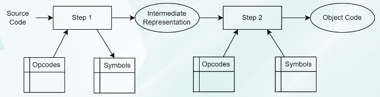
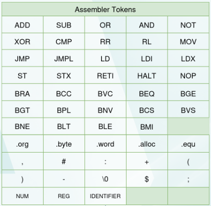

# VeSPA Assembler

## Assembler Overview

The assembler is implemented using a **two-step process**.  
It is also built using **Flex (lexer)** and **Bison (parser)**.

**Step 1 – Parsing & IR Generation**
- Reads and interprets the assembly source code.
- Uses the opcode table to identify instructions.
- Builds the **symbol table** (labels and their addresses).
- Produces an **Intermediate Representation (IR)** — a list of parsed statements.

**Step 2 – Object Code Generation**
- Uses the **IR + symbol table + opcode table**.
- Resolves labels and computes final addresses.
- Generates the final **machine/object code**.

<p align="center">
  
</p>

---

### Recognized Tokens (Lexical Rules)

<p align="center">
  
</p>

---

## How to Run

``` bash
make clean
make all
./Output/VASM test.asm
```
```
out.hex will be produced in /Output
```
