# RocketC – A VeSPA C Compiler

_A C compiler developed for educational purposes, targeting the VeSPA RISC architecture and generating VeSPA assembly and machine code._

---

## 📌 Table of Contents
- [Overview](#overview)
- [Compiler Architecture](#compiler-architecture)
- [Repository Structure](#repository-structure)
- [How to Build & Run](#how-to-build--run)
- [Compilation Flow](#compilation-flow)
- [Features & Limitations](#features--limitations)
- [Future Improvements](#future-improvements)
- [Authors](#authors)

---

## Introduction

**RocketC** is a custom C compiler developed specifically for the **VeSPA processor**, a RISC-based System-on-Chip implemented on FPGA.

It compiles C programs into **VeSPA Assembly** and **machine code**, which can then be executed on the hardware.

The goal of this project is to design and implement a full compilation flow capable of generating executable code for the VeSPA architecture, enabling high-level programming on a custom-built CPU.

---

## TEAM  

➡️ This project was developed by a team of 20 students as part of the Embedded Systems course. 

➡️ The class was organized into three groups, which rotated roles throughout the semester to cover different stages of the development process

➡️ The roles were:

- Rocket C Compiler Frontend - Current Repository  
- Rocket C Compiler Backend - Current Repository
- [CPU Pipeline (SoC Team)](https://github.com/Brunomvsilva/VESPA-SoC.git)  

---

## Repository Components

| Folder | Description |
|--------|-------------|
| [`Assembler/`](https://github.com/Brunomvsilva/RocketC-VeSPA-Compiler/tree/main/Assembler) | Contains Assembler code, which turns **VeSPA Assembly into machine code** (`.coe` / binary format). |
| [`Compiler/`](https://github.com/Brunomvsilva/RocketC-VeSPA-Compiler/tree/main/Compiler) | Contains the **RocketC VeSPA Compiler code** |
| [`Instruction Scheduler/`](https://github.com/Brunomvsilva/RocketC-VeSPA-Compiler/tree/main/Instruction%20Scheduler) | Includes the **Instruction Scheduler**, used to reduce hazards generated by the compiler in VeSPA code. |
| [`Simulator/`](https://github.com/Brunomvsilva/RocketC-VeSPA-Compiler/tree/main/Simulator) | **RocketSim - Software simulator for the VeSPA CPU**, capable of executing assembly/binary programs step-by-step. |
| [`Reports and Presentation/`](https://github.com/Brunomvsilva/RocketC-VeSPA-Compiler/tree/main/Reports%20and%20Presentation) | Includes the **project report and presentation slides**. |


---

## Tools & Programming Language Used

**Programming Language** - C

| Tool        | Purpose                                          |
|-------------|--------------------------------------------------|
| **VS Code** | Main development environment     |
| **GCC**     | C compiler used to develop the VESPA compiler     |
| **GNU Flex**    | Lexical analyzer generator (tokenizer)           |
| **GNU Bison**   | Parser generator for syntax, grammar definition and AST build |
| **Makefile**| Build automation and project compilation         |

---

## Compiler Overview

<p align="center">
  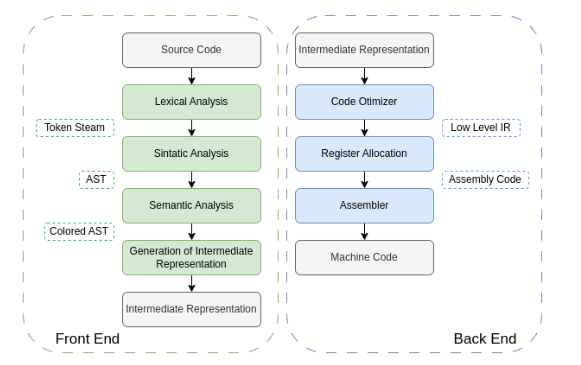
</p>

---

## Lexical Analysis

Lexical analysis is the **first stage of the compiler**. Its role is to read the input C source code and convert it into a sequence of **tokens**.
Anything that doesn't match the expected patterns of the language is reported as a **lexical error**.
As stated before, this was implemented using the open source GNU Flex tool.

**GNU Flex**

- Flex reads a specification file (`.l`) containing **regular expressions for tokens**.
- It generates a C source file that scans the input program and **produces tokens**.
- These tokens are then passed to the syntax parser (Bison).

**Why Flex is used:**
- Fast and efficient token scanning  
- Easy integration with C and Bison/Yacc  
- Supports regular expressions for easy token definition  
- Commonly used in real compilers (GCC, Clang, etc.)

The following elements were defined in the **lexer**:  
**reserved words**, **special symbols**, and their corresponding **regular expressions**.

<p align="center">
  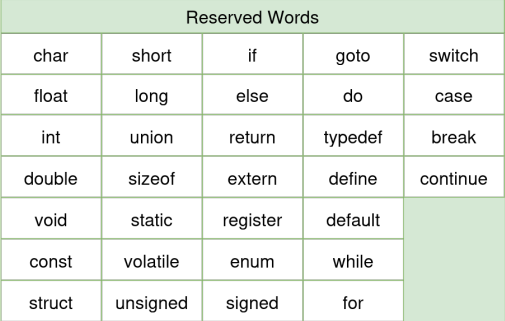
  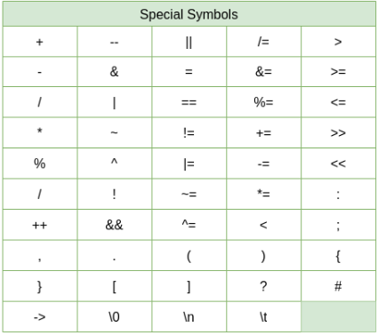
  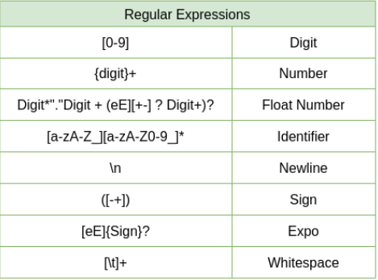
</p>

> **Limitations:**  
> The following C features are **not supported** in this version of the compiler:  
> `struct`, `typedef`, `enum`, `union`, `sizeof`, `->`, `.`

### Complete Lexer File (`LexScanner.l`)

The full lexer implementation for the VeSPA C Compiler is available here:  
[`Compiler/Lexer/LexScanner.l`](Compiler/Lexer/LexScanner.l)

---

## Syntatic Analysis

Syntax analysis (or **parsing**) is the **second stage of the compiler**. Its purpose is to take the tokens generated by the lexer and verify whether they follow the **grammar rules of the C language**.

If the code is syntactically correct, the parser constructs a **Parse Tree** or **Abstract Syntax Tree (AST)**.  
If the input does not follow the grammar, a **syntax error** is reported.

---

### GNU Bison

This stage is implemented using **GNU Bison**, a parser generator that works alongside Flex.
**GNU Bison is a bottom-up parser generator**. It reads a grammar specification file (`.y`) written in BNF (Backus–Naur Form) syntax.

It generates a **bottom-up** **LR parser**, which works as follows:

- Reads tokens from the lexer **from left to right**
- **Shifts** tokens onto a parsing stack
- **Reduces** groups of tokens according to grammar rules
- Repeats this process until everything is reduced into the **start symbol** of the grammar

### Why Bison is used:

- Integrates with **Flex**  
- Supports complex grammar definitions  
- Used in real compilers like **GCC**


### Grammar Rules

The complete grammar specifications are implemented in:  
[`Compiler/Parser/SyntaxParser.y`](Compiler/Parser/SyntaxParser.y)

### AST Nodes

This table details different types of nodes commonly found in an AST, along with their specific child nodes. Each row represents a type of node, and the columns indicate the different types of child nodes.

<p align="center">
  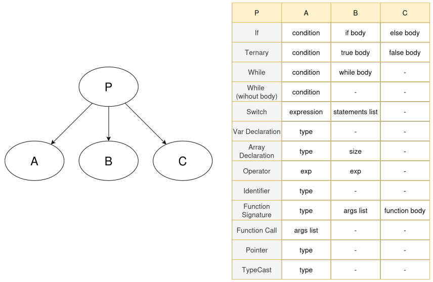
</p>

---

## Semantic Analysis

Semantic analysis is the **third stage of the compiler**.  
While syntax analysis checks if the structure of the program is valid, semantic analysis ensures it also makes **logical sense according to C language rules**.

It verifies:
- Variables are **declared before use**
- **Type compatibility** in expressions and assignments
- **Scope rules** are followed
- Functions are called with the **correct number and types of arguments**

---

### 🔹 Symbol Table & Scoped Organization

The compiler uses a **scoped symbol table system**, implemented with **hash tables** for fast insertion and lookup of identifiers.

Each block of code (global, function, or `{ }` block) has its own symbol table, and these tables are organized in a **hierarchical structure**.

<p align="center">
  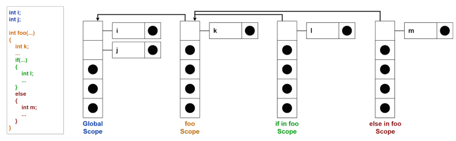
</p>

<p align="center">
  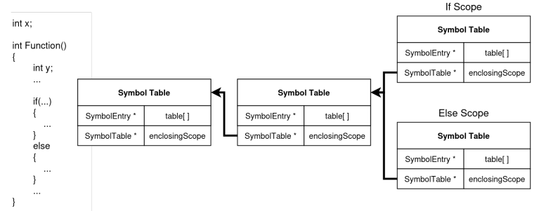
</p>

#### Key Features:
- Each symbol is associated with **the scope in which it was declared**
- Uses **nearest scope resolution** – the compiler searches the current scope first, then moves outward to parent scopes
- **Avoids naming conflicts** across different parts of the program
- **Hash tables** store symbols efficiently, and **linked lists** are used to handle hash collisions.

#### Visibility Rules:
- A variable declared in an **outer scope is visible to all inner scopes**
- A variable declared in an **inner scope is NOT visible outside that scope**

---

### Type-Checking - Strongly-Typed C

The VeSPA compiler implements a **strongly-typed subset of the C language**, which is more restrictive than standard C.

In **standard C**, the language is considered **weakly typed**, meaning many implicit or unsafe type conversions are allowed (sometimes with just a warning). This flexibility is powerful but can result in undefined behavior.

In **VeSPA C**, the compiler enforces stricter rules, so if a type is incorrect or incompatible, **the program will not compile**.

### Enforced Type Rules

- Array indices must be of type `INT`, `SHORT`, or `LONG`
- Increment (`++`) and decrement (`--`) operations are only valid on variables and pointers
- `switch` and `case` conditions must evaluate to `INT` or `CHAR`
- Conditions in `if`, `while`, `do-while`, `switch`, and ternary (`?:`) **cannot be of type `STRING`**
- Bitwise operators (`&`, `|`, `^`, `<<`, `>>`) only accept operands of type `INT`, `CHAR`, `SHORT`, or `LONG`
- Division by zero is not allowed
- Assigning a pointer to another pointer is allowed
- Assigning the address of a variable to a pointer is allowed
- Assigning a `STRING` to a `CHAR*` pointer is allowed
- Assigning an `INT` value to a `CHAR` variable is allowed
- Pointer typecasting is allowed

---

## Constant Folding Optimization

Constant folding is an optimization that checks the AST for operations where all operands are constants.  
If possible, it evaluates the result at compile time so the code generation phase has fewer nodes to process.

### Example

**Before:**
```
       (-)
      /   \
    (+)     10
   /   \
  x     (*)
       /   \
      3     7
```

**After**
```
       (-)
      /   \
    (+)     10
   /   \
  x     21
```
---

## VeSPA ABI – Application Binary Interface

The **Application Binary Interface (ABI)** defines how the code generated by the compiler interacts with the VeSPA hardware.  
It acts as an agreement between the **CPU architecture** and the **compiler**, ensuring that both interpret function calls, register usage, data formats and memory structures in a consistent manner.

This ABI specifies:

- Memory organization
- Register usage conventions
- Function calling conventions and stack frame layout
- Data representation (endianness, data sizes and alignment)
- Interrupt handling rules

**Full ABI specification** [here](Reports%20and%20Presentation/VeSPA__ABI.pdf).

### Register Usage (as defined in the ABI)

| Register | Purpose                                  | Caller-Saved |
|----------|-------------------------------------------|--------------|
| **R0**   | Constant zero (hardwired)                | –            |
| **R1**   | Return address for function calls        | Yes          |
| **R2**   | Frame Pointer (FP)                       | Yes          |
| **R3**   | Stack Pointer (SP)                       | Yes          |
| **R4–R5**| Return registers and special registers used for Mul/Div operations | No        |
| **R6–R31** | General-purpose temporary registers     | No           |

---
    
## Code Generation

The **Code Generation** phase is the final stage of the compiler.  
Its goal is to translate the validated Abstract Syntax Tree (AST) into **target assembly code** or **machine code** for execution.

Code Generation main flowchart is shown below

<p align="center">
  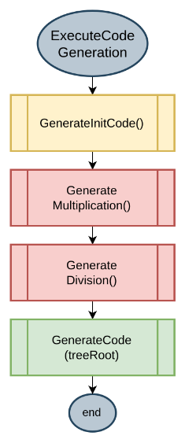
</p>

---

### Initialization Code

Before generating instructions for user-defined functions or statements, the compiler emits a small block of **initialization code** to properly set up the runtime environment.

- Place a `JMP` instruction at address `0x00` to jump to the initialization block located at `0x40`.
- Initialize the **Stack Pointer (R2)** and **Frame Pointer (R3)** to the top of the stack (address `1023`).
- Preload the **Return Address Register (R1)** with the address of a `HALT` instruction and push it onto the stack.  
  This ensures that when `main()` finishes execution, the program halts.
- Load a register with the address/label of the `main` function and jump to it.

```
.org 0x00
JMP R0, #64 ; Jump to initialization code at 0x40

.org 0x4000
HALT ; Stop execution

.org 0x40
LDI R2, #1023 ; Stack Pointer = top of stack
LDI R3, #1023 ; Frame Pointer = top of stack
LDI R1, #16384 ; Return address pointing to HALT
SUB R3, R3, #1 ; Adjust stack for storing return address
STX R1, R3, #0 ; Push return address onto stack
LDI R31, :FUNCTION_main
JMP R31, #0 ; Jump to main function

```
---

### Multiplication and Division function code generation

The baseline **VeSPA ISA** does not include native instructions for multiplication, division, or modulus.  
To support these operations, the compiler generates calls to **custom assembly functions**.

**How It Works**
- Multiplication, division, and modulus are **not hardware-supported**.
- These operations are implemented as **software routines** (assembly functions).
- When the compiler encounters `*`, `/`, or `%` in the AST, it generates a **function call** to these routines.
- These routines are generated in the beggining of the code generation step

**Algorithms Used**

| Operation | Algorithm |
|-----------|-----------|
| Multiplication | Shift-and-add multiplication |
| Division & Modulus | Restoring division algorithm |

---
### Stack and Global Variables Management

To support **function calls, local variables, recursion** and **parameter passing**, the compiler implements a **stack-based execution model** that follows the **ABI (Application Binary Interface)**.

### Stack Behavior

- The **stack grows downward**, toward lower memory addresses.  
- **R3 – Stack Pointer (SP)** always points to the top of the stack.  
- **R2 – Frame Pointer (FP)** marks the base address of the current stack frame.  
- Each function call creates a new **stack frame**, enabling recursion and nested calls.

### Global Variables

- Global variables are stored at the **bottom of RAM**, starting from **0x00**.  
- They are persistent throughout program execution and do not reside on the stack.

---

<table>
<tr>
<td>

### Parameter Passing and Return Values

| Mechanism | Convention |
|-----------|------------|
| **Argument passing** | All function parameters are passed on the stack. |
| **Access location**   | First argument at FP + 1, second at FP + 2, etc. |
| **Return value**      | Stored in R4, as defined by the ABI. |
| **Special case (Mul/Div)** | Parameters passed via R4 and R5. |

</td>
<td>

### Stack Frame Layout

| Section | Address (relative to FP) | Description |
|---------|---------------------------|-------------|
| **Arguments** | FP + 1, FP + 2, … | Parameters from the caller |
| **Return Address** | FP − 1 | Address to resume execution |
| **Previous FP** | FP | Saved frame pointer |
| **Local Variables** | FP − 2, FP − 3, … | Function-local variables |

</td>
</tr>
</table>


<div align="center">
  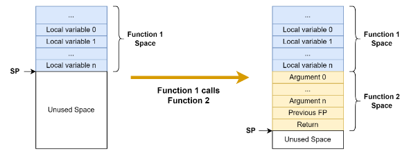
  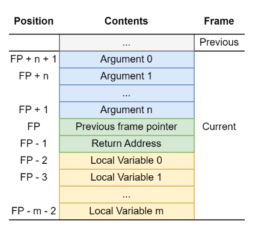
</div>

**Function Call Sequence**

- Caller pushes **arguments** onto the stack.  
- Caller pushes the **return address**.  
- Current **FP is saved**, and FP is updated to SP.  
- Callee reserves space for **local variables** (SP = SP – size).  
- On return:
  - Local variables are freed (SP restored).  
  - Previous FP and return address are restored.  
  - Control returns to the caller.

**This stack design ensures:**
- Support for **recursion and nested calls**  
- Separation of **local** and **global** data  
- ABI-compliant **parameter passing and return values**  
- A **caller–callee structure** for code generation, prologues and epilogues  

---

## AST Code generation

### Arithmetic Expressions Generation

- Parse the root node
- If both childs are terminals, the code is generated
- If not then we parse the non terminal childs (left first)

<p align="center">
  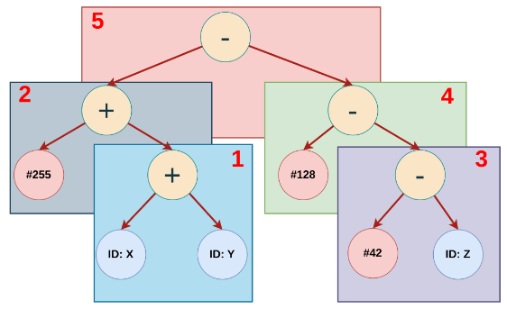
</p>

### Handling Subtractions with immediates

- VeSPA ALU only allows immediate values on the right operand (Source B), so it was established that nodes with an immediate left child are handled with an add instruction, by negating the immediate value and the result of the sum, as shown below.

  <p align="left"><code>42 - x = -(x + (-42))</code></p>

- Operations with 2 immediates will not exist because we applied constant folding, so they dont need to be handled in this stage.


<p align="center">
  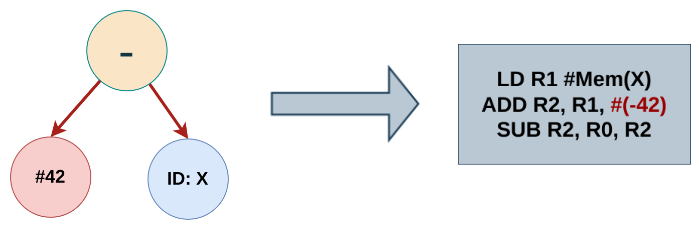
</p>

### Code Generation Templates

To generate VeSPA assembly, a set of **code generation templates** was defined.  
Each template specifies how a particular language construct (such as `if`, `while`, assignments, or function calls) is emitted into assembly.

Below is an example of the template used for the **`if` statement**, demonstrating how conditional evaluation, jump labels, and control flow are generated.

All the other templates can be found in the [report](Reports%20and%20Presentation/Compiler_Report.pdf).

<div align="center">

<table>
  <tr>
    <td align="center" valign="middle" width="50%">
      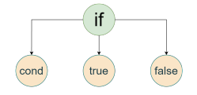
    </td>
    <td align="center" valign="middle" width="50%">
      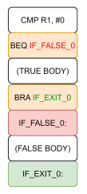
    </td>
  </tr>
</table>

</div>

---

## How to Run the Compiler

### Install Dependencies

```bash
sudo apt update
sudo apt install build-essential flex bison make
```

### Makefile

This project provides a Makefile that can build individual components or the full compiler.

Available targets:
- `make setup`  — create the `Output/` directory
- `make lexer`  — generate the lexer (`Output/lex.yy.c`) using Flex
- `make parser` — generate the parser (`Output/Parser.tab.c/.h`) using Bison (warnings suppressed)
- `make src`    — compile sources into the executable `Output/RocketC`
- `make all`    — run: setup → parser → lexer → compile
- `make prog`   — run the compiler on `TestCodeGen.c`
- `make clean`  — remove the entire `Output/` directory
- `make run`    — clean, rebuild everything, then run the test (`TestCodeGen.c`)

Build everything:

    make all

---

### Testing

Two ways to test the compiler.

1) Using your own C file:

```bash    
./Output/RocketC <SourceFile.c> --parse
```

2) Using the provided test file in project root (`TestCodeGen.c`):

    `make all`
   
    `make prog`

Or, to force a clean rebuild and then run:

    make run

---

## Output

After running the compiler:

- The generated assembly is written to: `Output/Rocket.asm`
- If the program uses `*`, `/`, or `%`, the compiler inserts predefined multiplication/division/modulo routines at the top of the assembly file.
  - These routines use `RL` (rotate left) and `RR` (rotate right), since the architecture lacks native multiply/divide instructions.
  - They are only included when needed.
- The terminal output also includes:
  - The Abstract Syntax Tree (AST)
  - Symbol tables
  - Any semantic errors or warnings

