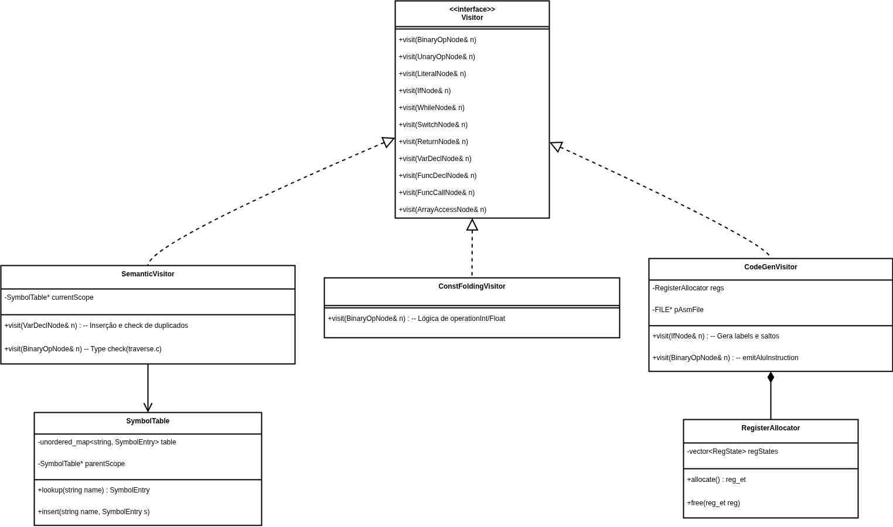

# RocketC VeSPA Compiler

This project is a compiler for the **RocketC** language, specifically targeting the **VeSPA** processor architecture.

## Project Evolution
Originally built as a procedural compiler in C, this project is currently undergoing a refactor to modern **C++17**.
It serves as a personal pet project with the objective of learning/applying C++ concepts 

### Core Refactor Objectives
* **Visitor Pattern Implementation**
* **Modern Memory Management**: Utilizing **RAII** and smart pointers (`std::unique_ptr`) to eliminate manual `free()` calls and prevent memory leaks.
* **Standard Library Integration**: Replacing custom legacy data structures with the C++ Standard Template Library (STL), such as `std::unordered_map` for Symbol Tables.

---

## Architecture & Design
The refactored version centers around the **Visitor Design Pattern**.

### Key Components:
* **AST Nodes**: Represented by the `Node` hierarchy.
* **SemanticVisitor**: Responsible for scope analysis, symbol table management (`SymbolTable`), and type checking.
* **ConstFoldingVisitor**: An optimization pass that evaluates constant expressions at compile time.
* **CodeGenVisitor**: Handles the translation of the AST into VeSPA-compatible assembly

---

## Directory Structure
* `../OldCompiler`: The legacy procedural C implementation (Reference).
* `./refactor`:
    * `./AST`: Definition of the new node hierarchy.
    * `./Semantics`: Logic for semantic analysis and symbol tables.
    * `./Bridge`: Integration layer between the legacy Lexer/Parser (Flex/Bison) and the new C++ AST.
